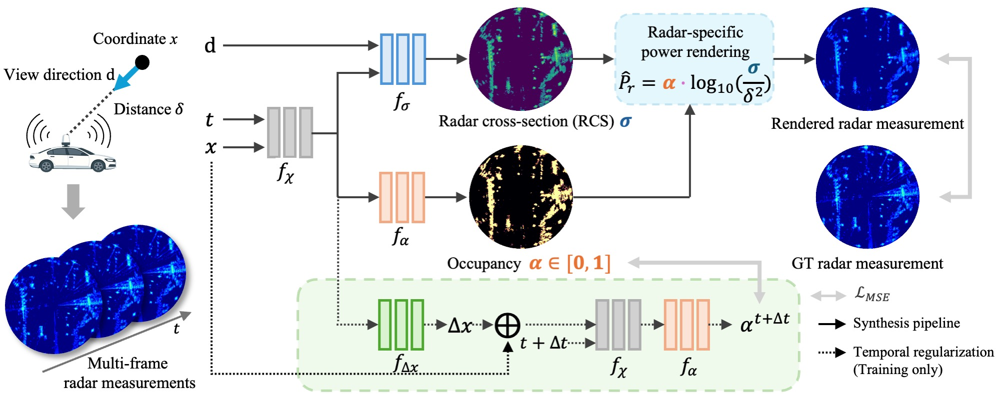

# RF4D: Neural Radar Fields for Novel View Synthesis in Outdoor Dynamic Scenes

Welcome! This is the official repo of the paper "[RF4D: Neural Radar Fields for Novel View Synthesis in Outdoor Dynamic Scenes](https://cvpr.thecvf.com/virtual/2026/poster/38536)".

- Jiarui Zhang, Zhihao Li, Chong Wang, Bihan Wen

## Framework



## Environment Setup

The current release includes the data preparation scripts used to build the RF4D/LiDAR4D metadata from Boreas sequences.

Create the conda environment following our `radarfields` dependency setup:

```bash
conda create -n rf4d python=3.9.18 -y
conda activate rf4d
```

Install PyTorch 2.0.1 with CUDA 11.7:

```bash
conda install pytorch==2.0.1 torchvision==0.15.2 torchaudio==2.0.2 pytorch-cuda=11.7 -c pytorch -c nvidia -y
```

Install the remaining packages used by the data preparation scripts and notebook:

```bash
pip install \
  numpy==1.24.4 \
  tqdm==4.65.0 \
  pillow==9.5.0 \
  matplotlib==3.5.3 \
  opencv-python==4.11.0 \
  jupyter==1.1.1 \
  ipykernel==6.28.0
```

Install the PyTorch binding of [tiny-cuda-nn](https://github.com/NVlabs/tiny-cuda-nn). Make sure `nvcc` is available before installing:

```bash
nvcc --version
pip install ninja
pip install git+https://github.com/NVlabs/tiny-cuda-nn/#subdirectory=bindings/torch
```

If the direct pip install fails, compile it from a local clone:

```bash
git clone --recursive https://github.com/NVlabs/tiny-cuda-nn.git
cd tiny-cuda-nn/bindings/torch
python setup.py install
cd ../../..
```

Verify the installation:

```bash
python -c "import torch; import tinycudann as tcnn; print(torch.__version__, torch.version.cuda); print('tiny-cuda-nn OK')"
```

Register the environment as a Jupyter kernel:

```bash
python -m ipykernel install --user --name rf4d --display-name "Python (rf4d)"
```

When running `data_preparation/data.ipynb`, select the `Python (rf4d)` kernel.

## Data Preparation

### 1. Prepare Boreas data

Download the required Boreas sequences and keep the original sequence structure. The scripts expect each sequence to contain the following folders/files:

```text
<project_folder>/
  boreas-YYYY-MM-DD-HH-MM/
    applanix/
      radar_poses.csv
      lidar_poses.csv
      camera_poses.csv
    radar/
      <radar_timestamp>.png
    lidar/
      <lidar_timestamp>.bin
    camera/
      <camera_timestamp>.png
```

In the examples below, `<project_folder>` is the root folder containing the Boreas sequences.

### 2. Generate sensor pose files

Run:

```bash
python data_preparation/get_3d_radar_poses.py \
  --project_folder /path/to/boreas \
  --sequence boreas-2020-12-18-13-44 \
  --dimension 2
```

This reads the Applanix CSV files and writes NumPy pose/timestamp files to:

```text
<project_folder>/<sequence>/LidarRadarGuide/
  radar_poses_2.npy
  radar_times.npy
  lidar_poses_2.npy
  lidar_times.npy
  camera_poses_2.npy
  camera_times.npy
```


### 3. Build frame metadata

Open `data_preparation/data.ipynb` and set the dataset variables in the first code cell:

```python
project_folder = "/path/to/boreas"
save_folder = "/path/to/boreas/LidarRadarGuide"
condition = "snow"  # or "sunshine", "rain", "static"
sequence = "boreas-2021-01-26-11-22"
first_frame = 1090
last_frame = 1182
dim = 2
```

Then run the notebook cells for sequence segmentation. The notebook matches each radar frame to the closest LiDAR and camera frame and writes:

```text
<project_folder>/LidarRadarGuide/
  <sequence>_<first_frame>_<last_frame>_<dim>d.json
```

Each frame entry contains radar, LiDAR, and camera file paths, timestamps, and poses.

### 4. Generate LiDAR range views and split JSON files

In the LiDAR4D section of `data_preparation/data.ipynb`, configure the LiDAR panorama parameters:

```python
H = 128
W = int(360 / 0.2)
intrinsics = (15, 40)  # fov_up, fov
```

Run the LiDAR range-view generation cells to create:

```text
<project_folder>/<sequence>/lidar_range_view/
  <lidar_timestamp>.npy
```

Then run the LiDAR4D JSON generation cells. They create train/val/test split files under `save_folder`:

```text
Lidar4D_<sequence>_train_<first_frame>_<last_frame>_<dim>d.json
Lidar4D_<sequence>_val_<first_frame>_<last_frame>_<dim>d.json
Lidar4D_<sequence>_test_<first_frame>_<last_frame>_<dim>d.json
```

The notebook also computes the scene scale/offset and writes config files for LiDAR4D and Radar4D. Update the hard-coded config output paths in the notebook if your local workspace is different.

### 5. Generate radar occupancy supervision

The final section of `data_preparation/data.ipynb` computes radar occupancy maps from the radar FFT images. It writes:

```text
<project_folder>/<sequence>/occ/
  <radar_timestamp>.npy
```

The default settings used by the notebook are:

```python
min_range = 0
max_range = 3360
```

You can visualize the generated occupancy maps with the provided `visualize_fft_and_occupancy` helper in the notebook.

## Training Example

After preparing the Boreas metadata and activating the `rf4d` environment, run the sunshine sequence example:

```bash
cd src

python main.py \
  --config configs/Radar4D_boreas-2020-12-18-13-44_3412_3512_2d_config.ini \
  --save_loss_plot \
  --num_fov_samples 3 \
  --weight_fft 0.9 \
  --fft_loss mse \
  --lr 1e-4 \
  --device cuda:0 \
  --workspace ./log/sun \
  --bs 4 \
  --iters 15000 \
  --train_thresholded \
  --reg_alpha_mean \
  --weight_alpha_mean 5e-3 \
  --alpha_consistent \
  --weight_alpha_consistent 1e-2 \
  --flow_reg \
  --weight_flow_reg 1e-4
```

The run writes logs, checkpoints, and loss plots to the folder specified by `--workspace`.

## Todo List

- [x] Upload the code.
- [ ] The released code is still under checking.

## :star: Citation

Please cite our paper if you find our work useful. Thanks! 

```
@inproceedings{zhang2026rf4d,
  title={Rf4d: Neural radar fields for novel view synthesis in outdoor dynamic scenes},
  author={Zhang, Jiarui and Li, Zhihao and Wang, Chong and Wen, Bihan},
  booktitle={Proceedings of the IEEE/CVF Conference on Computer Vision and Pattern Recognition},
  pages={15387--15397},
  year={2026}
}
```

## :email: Contact

If you have any questions, please feel free to contact me via `zhan0618@ntu.edu.sg`.
