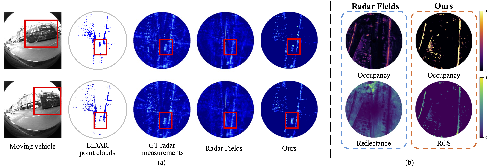

# RF4D:Neural Radar Fields for Novel View Synthesis in Outdoor Dynamic Scenes
Welcome! This is the official repo of the paper "[RF4D:Neural Radar Fields for Novel View Synthesis in Outdoor Dynamic Scenes](https://arxiv.org/abs/2505.20967)". The code will be released soon.

- Jiarui Zhang, Zhihao Li, Chong Wang, Bihan Wen
  


## Framework


## Results


## :star: Citation
Please cite our paper if you find our work useful. Thanks! 
```
@article{zhang2025rf4d,
  title={RF4D: Neural Radar Fields for Novel View Synthesis in Outdoor Dynamic Scenes},
  author={Zhang, Jiarui and Li, Zhihao and Wang, Chong and Wen, Bihan},
  journal={arXiv preprint arXiv:2505.20967},
  year={2025}
}
```

## :email: Contact
If you have any questions, please feel free to contact me via `zhan0618@ntu.edu.sg`.
